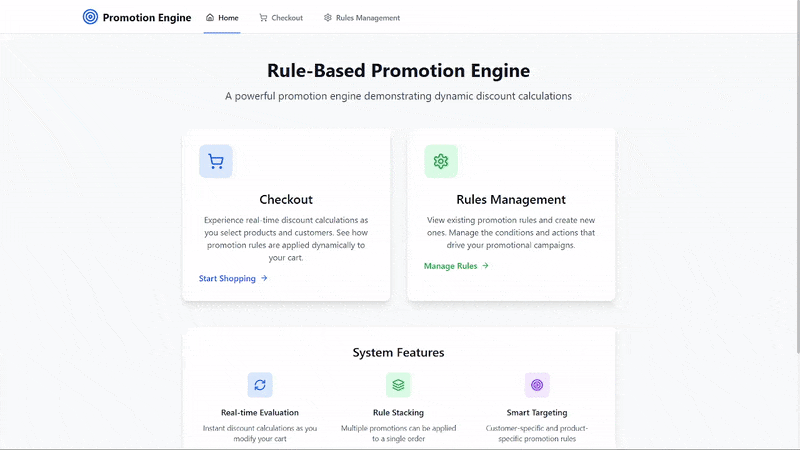

# Rule-Based Promotion Engine

> A modern e-commerce promotion system built with React, Laravel, and Node.js featuring dynamic rule evaluation and real-time discount calculations.

## Features

- **Dynamic Rule Engine** - Flexible promotion rules with complex conditions and actions
- **Real-time Evaluation** - Instant discount calculations during checkout
- **Modern UI** - Responsive React frontend with Tailwind CSS
- **RESTful API** - Laravel backend with comprehensive API endpoints
- **Microservices Architecture** - Dedicated Node.js rule engine service
- **Database Management** - MySQL with optimized schema for promotions

## Tech Stack

**Frontend:**

- React 19.1.0
- React Router DOM 7.6.3
- Tailwind CSS 3.4.17
- Axios for API calls
- Lucide React Icons
- Vite for build tooling

**Backend:**

- Laravel 11.0 (PHP 8.2+)
- MySQL database
- RESTful API architecture
- Service layer pattern

**Rule Engine:**

- Node.js with Express.js
- json-rules-engine library
- CORS enabled
- Microservice architecture

## Rule Engine Library Justification

### Why json-rules-engine?

**json-rules-engine** was selected as the core rule evaluation library for the following reasons:

1. **JSON-Based Rule Definition**

   - Rules are defined in pure JSON format, making them database-friendly and easily serializable
   - Non-technical users can potentially create rules through a UI that generates JSON
   - Rules can be stored, versioned, and modified without code changes

2. **Flexible Condition Logic**

   - Supports complex boolean logic with AND, OR, and nested conditions
   - Built-in operators for common comparisons (equals, greater than, contains, etc.)
   - Custom operators can be defined for domain-specific logic

3. **Event-Driven Architecture**

   - Emits events when rules are triggered, allowing for loose coupling
   - Easy to integrate with logging, analytics, and notification systems
   - Supports multiple actions per rule with conditional execution

4. **Performance & Scalability**

   - Lightweight library with minimal dependencies
   - Efficient rule evaluation with short-circuit logic
   - Stateless design perfect for microservices architecture

5. **Extensibility**

   - Custom facts can be defined for any data structure
   - Operators can be extended for specific business logic
   - Easy integration with external APIs and data sources

6. **Developer Experience**
   - Well-documented with comprehensive examples
   - Active community support and regular updates
   - TypeScript support for better development experience

### Alternative Considerations

- **Drools (Java)**: Too heavy for our Node.js microservice approach
- **Business Rules Engine (Python)**: Limited JSON serialization support
- **Custom Implementation**: Would require significant development time and testing

The json-rules-engine library perfectly balances simplicity, flexibility, and performance for our e-commerce promotion use case.

## System Architecture

<div align="center">
  
  <br>
  <em>Microservices architecture with React frontend, Laravel API, and Node.js rule engine</em>
</div>

## User Interface

### Website Demo

<div align="center">
  
  <br>
  <em>Complete website walkthrough showcasing rule-based promotion system in action</em>
</div>

### Application Screenshots

<div align="center">
  <table>
    <tr>
      <td><strong>Home Dashboard</strong></td>
      <td><strong>Rule Management</strong></td>
    </tr>
    <tr>
      <td></td>
      <td></td>
    </tr>
    <tr>
      <td><em>Main dashboard with product catalog and navigation</em></td>
      <td><em>Dynamic rule creation and management interface</em></td>
    </tr>
  </table>
</div>

<div align="center">
  <table>
    <tr>
      <td><strong>Checkout Process</strong></td>
      <td><strong>404 Error Page</strong></td>
    </tr>
    <tr>
      <td></td>
      <td></td>
    </tr>
    <tr>
      <td><em>Real-time discount calculation during checkout</em></td>
      <td><em>Custom 404 error page with user-friendly navigation</em></td>
    </tr>
  </table>
</div>

### Promotion Engine in Action

<div align="center">
  
  <br>
  <em>Real-time rule evaluation and discount application</em>
</div>

## Code Highlights

### Rule Engine Service Architecture

<div align="center">
  
</div>

### Laravel API Controllers

<div align="center">
  
</div>

## Architecture

### Services Layer

<div align="center">
  
  <br>
  
  <br>
  <em>Laravel services and Node.js microservice communication</em>
</div>

### React Components

<div align="center">
  
  <br>
  <em>Component-based frontend architecture</em>
</div>

### Database Schema

<div align="center">
  
  <br>
  <em>MySQL database schema for promotions</em>
</div>

## Getting Started

### Prerequisites

- PHP 8.2+
- Node.js (v16+)
- MySQL 8.0+
- Composer
- npm or yarn

### Installation

1. **Clone the repository**

   ```bash
   git clone <repository-url>
   cd rule-based-promotion
   ```

2. **Backend Setup (Laravel)**

   ```bash
   cd backend
   composer install

   # Configure environment
   cp .env.example .env
   # Edit .env with your MySQL credentials and app settings

   # Generate application key
   php artisan key:generate

   # Setup database
   php artisan migrate
   php artisan db:seed

   # Start Laravel server
   php artisan serve --port=8000
   ```

3. **Rule Engine Setup (Node.js)**

   ```bash
   cd rule-engine
   npm install

   # Start rule engine service
   npm run dev
   ```

4. **Frontend Setup (React)**

   ```bash
   cd frontend
   npm install

   # Start development server
   npm run dev
   ```

5. **Access the application**
   - Frontend: http://localhost:5173
   - Laravel API: http://localhost:8000
   - Rule Engine: http://localhost:3000

## API Endpoints

### Rule Management

```
GET    /api/v1/rules           - List all promotion rules
POST   /api/v1/rules           - Create new promotion rule
GET    /api/v1/rules/{id}      - Get specific rule
PUT    /api/v1/rules/{id}      - Update rule
DELETE /api/v1/rules/{id}      - Delete rule
```

### Rule Evaluation

```
POST   /api/v1/evaluate        - Evaluate rules against cart/customer data
POST   /api/v1/apply-discount  - Apply calculated discounts
```

### Products & Categories

```
GET    /api/v1/products        - List products
GET    /api/v1/categories      - List categories
GET    /api/v1/customers       - List customers
```

## Database Schema

### Core Tables

- **promotion_rules** - Stores rule definitions and conditions
- **customers** - Customer information and segments
- **products** - Product catalog with categories
- **categories** - Product categorization
- **rule_applications** - Track applied promotions

## Security Features

- **Input Validation** - Comprehensive request validation
- **CORS Configuration** - Controlled cross-origin requests
- **Rate Limiting** - API endpoint protection
- **SQL Injection Prevention** - Eloquent ORM protection

## Key Features Demonstrated

### Laravel Backend

- **Service Layer Architecture** for business logic separation
- **Eloquent ORM** for database interactions
- **API Resources** for consistent JSON responses
- **Custom Middleware** for validation
- **Artisan Commands** for maintenance tasks

### React Frontend

- **Modern React Hooks** (useState, useEffect, useContext)
- **React Router** for client-side routing
- **Axios Interceptors** for API communication
- **Tailwind CSS** for responsive design
- **Component Composition** for reusable UI elements

### Node.js Rule Engine

- **json-rules-engine** for complex rule evaluation
- **Express.js** RESTful API
- **Microservice Architecture** for scalability
- **Real-time Processing** with optimized performance

## Rule Engine Capabilities

### Supported Conditions

- **Product-based** - SKU, category, price, quantity
- **Customer-based** - Segment, purchase history, loyalty status
- **Cart-based** - Total amount, item count, combinations
- **Time-based** - Date ranges, seasonal promotions

### Supported Actions

- **Percentage Discounts** - Apply percentage off
- **Fixed Amount Discounts** - Apply fixed amount off
- **Buy X Get Y** - Complex promotional offers
- **Tiered Discounts** - Volume-based pricing

## Performance Optimizations

- **Database Indexing** - Optimized queries for rule evaluation
- **Microservice Communication** - Efficient HTTP API calls
- **Frontend Optimization** - Code splitting and lazy loading

## Future Enhancements

- [ ] Real-time rule performance analytics
- [ ] A/B testing for promotion strategies
- [ ] Advanced customer segmentation
- [ ] Machine learning for promotion recommendations
- [ ] Mobile app integration
- [ ] Multi-currency support
- [ ] Advanced reporting dashboard

## Testing

```bash
# Laravel backend tests
cd backend
php artisan test

# Frontend tests
cd frontend
npm run test
```

### Unit Tests

<div align="center">
  
  <br>
  <em>Comprehensive unit test coverage for Laravel backend</em>
</div>

---

<div align="center">
  <strong>Built with React, Laravel, and Node.js</strong>
  <br>
  <em>Modern microservices architecture for scalable e-commerce promotions</em>
</div>
